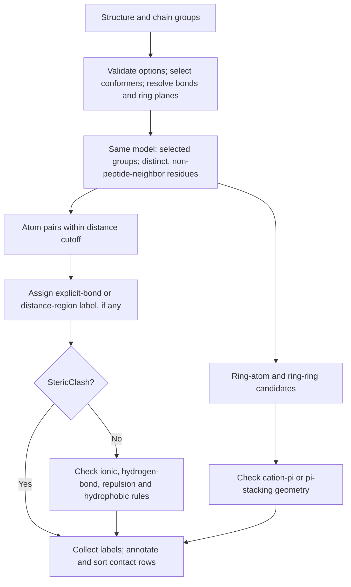

# Scientific conventions

- Contact rows use `Disulfide` for resolved PDB `SSBOND` or mmCIF disulfide
  declarations and `Covalent` for other resolved `LINK`, `CONECT`, or
  `_struct_conn` bonds. Undeclared CYS pairs matching the original distance and
  CB--SG--SG--CB dihedral rule produce `PotentialDisulfide`; other contacts in
  the covalent-distance band produce `PotentialCovalent`. Clash and van der
  Waals regions are separately named.
- Explicit hydrogen-bond geometry uses only hydrogens associated with the donor
  atom. Missing donor hydrogens produce warnings; Arpeggia does not protonate
  input structures.
- Histidines use `AllCharged` by default for Arpeggio-compatible
  positive-ionisable typing. `Heuristic` applies explicit evidence followed by
  a pH-dependent intrinsic-pKa prior, while `ExplicitOnly` never guesses.
  Inferred histidine charge produces potential ionic, repulsion, and cation-pi
  labels rather than definitive ones.
- All analyses deterministically choose the highest-occupancy alternate
  conformer, with `A` as the tie-breaker, and warn when selection occurs.
- Standard atom, residue, and chain SASA use one atom population and ProtOr
  radii with elemental fallback. Polar/hydrophobic columns follow Rosetta's
  legacy `SasaFilter` atom partition; numerical areas remain Shrake–Rupley.
- dSASA is the two-sided buried area
  `SASA(group 1) + SASA(group 2) - SASA(complex)`. Divide by two only when a
  one-sided interface-area convention is required.
- SAP uses the Rosetta-compatible full-atom Reduce-radius exposure definition
  with a 1.1 Å default probe and sums positive score contributions while
  reporting complete side-chain SASA. Arpeggia does not add missing atoms, so
  direct Rosetta comparison requires the same caller-prepared full-atom input.
  Monomers without a Rosetta calibration are omitted with a warning.
- RMSD uses uniform-weight Kabsch superposition with proper rotations and exact
  selected-atom correspondence by default. Optional [sequence correspondence and
  refinement](https://github.com/y1zhou/arpeggia/blob/master/docs/sequence-alignment.md) preserve a separate evaluation population.
  Structure clustering uses the resulting
  pairwise RMSD matrix and observed medoid structures; it does not perform
  sequence alignment or add missing atoms.

## Contact-identification decision path

Arpeggia classifies eligible pairs using atom identities, input bond records,
distances, and geometry. A nearby pair can produce **zero, one, or several
contact rows**, one per retained label.



### Which pairs are considered?

The atom search excludes hydrogen atoms as contact endpoints; explicit hydrogens
remain available for donor geometry. Atom-atom and ring-center-to-atom searches
use `dist_cutoff` (default 6.5 Å). Ring-ring comparisons instead use their own
geometry limits below. Reducing `dist_cutoff` therefore does not impose the same
limit on ring-ring contacts.

All branches apply model, chain-group, and residue eligibility checks. Same-residue
pairs and actual peptide neighbors are skipped; peptide adjacency uses backbone
connectivity and chain-break metadata, rather than residue numbering alone.
Symmetric comparisons are deduplicated. Explicit bond declarations are classified
only after a pair passes these candidate checks.

### Atom-pair decisions

First, apply the following rules **in order**, keeping the first matching label.
Here `d` is the atom distance, `c` is `vdw_comp` (default 0.1 Å), and `Rcov`
and `Rvdw` are the sums of the two atoms' covalent and van der Waals radii.

| First matching condition | Label |
| --- | --- |
| Resolved explicit disulfide declaration | `Disulfide` |
| Other resolved explicit bond | `Covalent` |
| `d < Rcov - c` | `StericClash` |
| `d < Rcov + c`, both atoms CYS SG, both CB atoms present, absolute CB–SG–SG–CB dihedral 60–120° | `PotentialDisulfide` |
| `d < Rcov + c` | `PotentialCovalent` |
| `d < Rvdw` | `VanDerWaalsClash` |
| `d < Rvdw + c` | `VanDerWaalsContact` |

If no rule matches, this stage adds no label. Missing required radii also leave
the distance-region label unset. Only `StericClash` ends classification of this
atom pair; all other outcomes continue through the chemical checks:

```text
ionic = opposite-charge rule within 4.0 Å
hbond = strong donor–acceptor geometry, or polar-distance fallback
if ionic is IonicBond and hbond is HydrogenBond:
    add SaltBridge
else if ionic exists:
    add ionic
else if hbond exists:
    add hbond

independently add any matching:
    weak hydrogen bond (or weak polar fallback)
    like-charge repulsion within 4.0 Å
    hydrophobic atom-pair contact within 4.5 Å
```

Thus `SaltBridge` replaces the individual ionic and strong hydrogen-bond labels.
A potential ionic assignment cannot establish a definite salt bridge. Atom typing
and histidine charge follow the conventions above; proximity alone is insufficient.

For either hydrogen-bond check, donor–acceptor distance must be at most 4.0 Å,
an associated donor hydrogen must be within the hydrogen-plus-acceptor van der
Waals radii plus `c`, and the donor–H–acceptor angle must be at least 90°
(130° for a weak hydrogen bond). If that geometry is not established, a typed
donor–acceptor pair within 3.5 Å can still receive `PolarContact` or
`WeakPolarContact`. Missing hydrogens therefore limit interpretation without
eliminating every possible contact.

### Aromatic decisions

These checks run separately from atom-pair classification. Missing ring atoms or
unusable ring geometry produce a warning and omit that ring's interactions.

| Candidate | Decision |
| --- | --- |
| Ring and positively typed atom | Center-to-atom distance ≤ 4.5 Å and angle to the ring normal ≤ 30°: `CationPi`, or `PotentialCationPi` for inferred charge. |
| Two rings | Center distance ≤ 6.0 Å: classify relative ring-plane and center-vector angles as sandwich, displaced, parallel-in-plane, tilted, L, or T stacking. T stacking additionally requires distance ≤ 5.0 Å. |

The implementation details and atom-typing tables live in the
[candidate and label assembly](https://github.com/y1zhou/arpeggia/blob/master/src/contacts/complex.rs),
[bond/distance rules](https://github.com/y1zhou/arpeggia/blob/master/src/contacts/vdw.rs),
[hydrogen-bond rules](https://github.com/y1zhou/arpeggia/blob/master/src/contacts/hbond.rs),
[charge rules](https://github.com/y1zhou/arpeggia/blob/master/src/contacts/ionic.rs),
[hydrophobic rules](https://github.com/y1zhou/arpeggia/blob/master/src/contacts/hydrophobic.rs), and
[aromatic geometry rules](https://github.com/y1zhou/arpeggia/blob/master/src/contacts/aromatic.rs).
